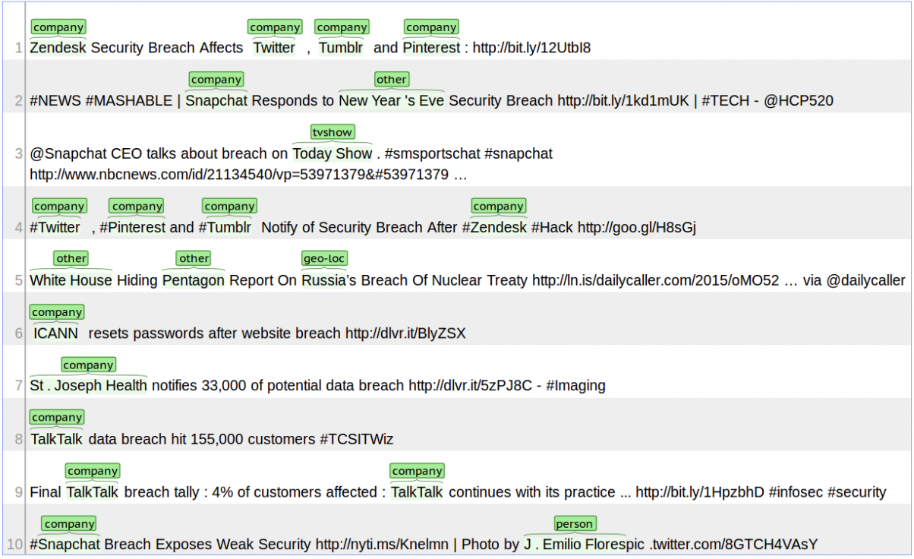

# NLP-Empowered-Named-Entity-Recognition
    EntitySense utilizes advanced NLP techniques to automatically identify and categorize entities in text data. With deep learning and semantic analysis, it offers accurate entity recognition, enabling applications like information extraction and sentiment analysis across different domains.

## Problem Statement
Twitter is a microblogging and social networking service on which users post and interact with messages known as "tweets". Every second, on average, around 6,000 tweets are tweeted on Twitter, corresponding to over 350,000 tweets sent per minute, 500 million tweets per day.

Twitter wants to automatically tag and analyze tweets for better understanding of the trends and topics without being dependent on the hashtags that the users use. Many users do not use hashtags or sometimes use wrong or mis-spelled tags, so they want to completely remove this problem and create a system of recognizing important content of the tweets.

Named Entity Recognition (NER) is an important subtask of information extraction that seeks to locate and recognise named entities.

You need to train models that will be able to identify the various named entities.

## Data Description

Dataset is annotated with 10 fine-grained NER categories: person, geo-location, company, facility, product,music artist, movie, sports team, tv show and other. Dataset was extracted from tweets and is structured in CoNLL format., in English language. Containing in Text file format.

The CoNLL format is a text file with one word per line with sentences separated by an empty line. The first word in a line should be the word and the last word should be the label.

## Consider the two sentences below;

`sentence 1:` Harry Potter was a student living in london
1. Harry B-PER
1. Potter I-PER
1. was O
1. a O
1. student O
1. Living O
1. in O
1. London B-geo-loc

`sentence 2:` Albus Dumbledore went to the Disney World

1. Albus B-PER
1. Dumbledore I-PER
1. went O
1. to O
1. the O
1. Disney B-facility
1. World I-facility

These two sentences can be prepared in a CoNLL formatted text file as above.
